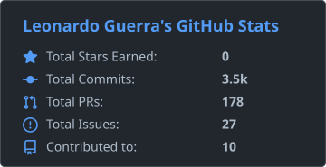
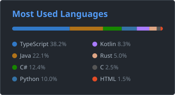

# Hi there, I'm Leonardo Guerra 👋

**Full Stack Developer** — backend, frontend & cloud — based in São Paulo, Brazil 🇧🇷

 

---

## 🛠️ Tech Stack

---

## 📊 GitHub Stats

---

💬 Feel free to reach out!

